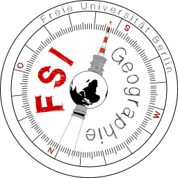

# protokoll2nextcloud

This package is used internally by the [FSI Geographie](https://fsigeographiefuberlin.wordpress.com/) of the FU Berlin to automatically upload any 
protocols of our plena to Nextcloud. The goal, however, is to keep this package as general as possible so that any E-Mail attachment can be converted to PDF 
and uploaded to Nextcloud folder. 

## Installation

`tba`

## Usage

`tba`

